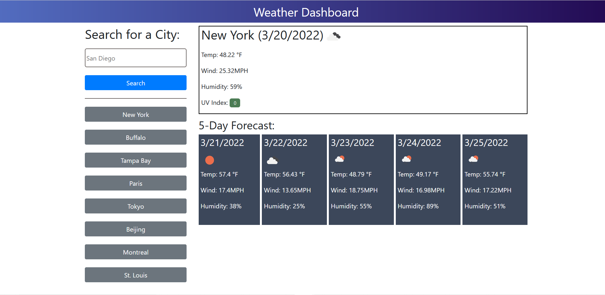

# Weather Dashboard

## Description
This application allows the user to search for the weather of a particular city, and see both the current weather and a five-day forecast displayed on the screen.
The user can see the dates for each forecasted day, as well as the temperature, wind speed, and humidity.
The current UV index and icons for current and future conditions are also shown.

The weather information comes from https://openweathermap.org

The user's last 8 searches are stored in localStorage and can be seen on the left side of the page.
When the user clicks on one of those cities, that city's weather is displayed.

## Link to site
https://patricklquirk.github.io/weather-dashboard/

## Image of site
